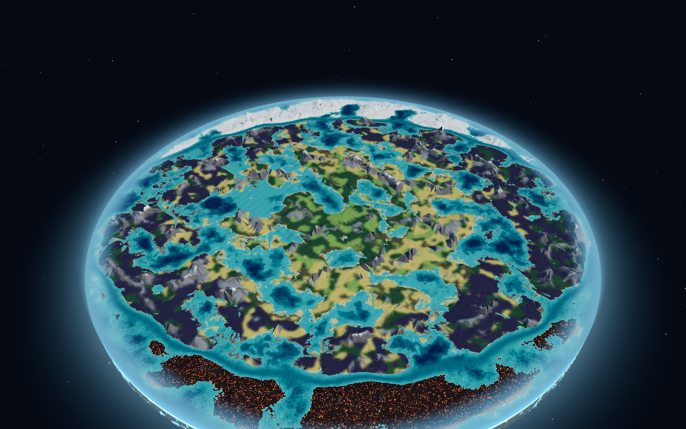
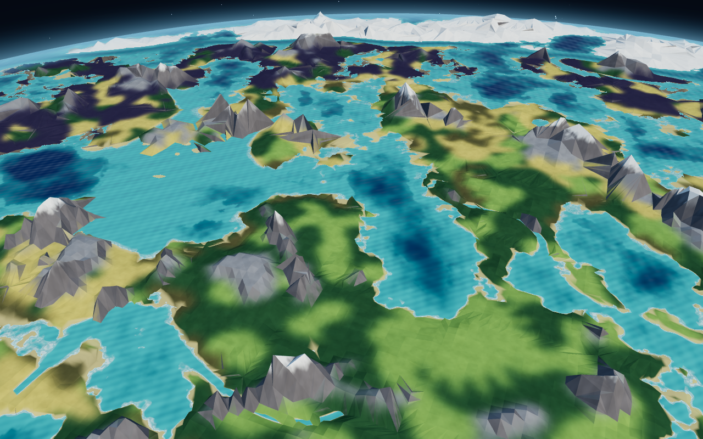
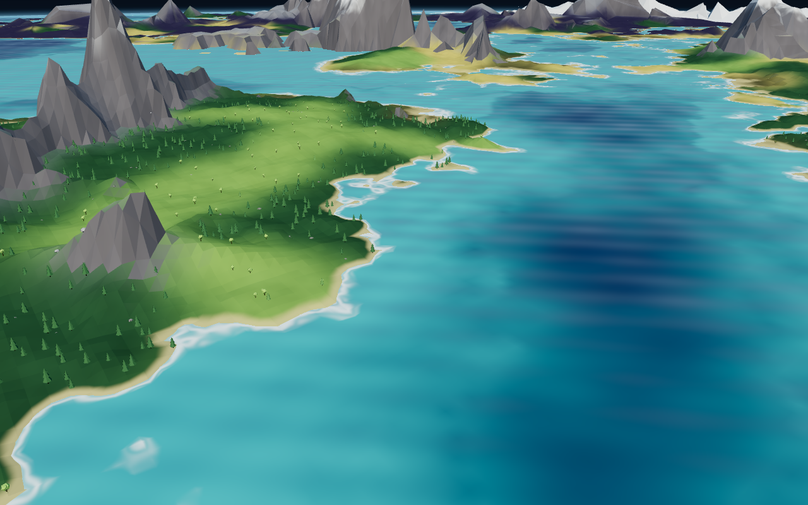

# Valheim Atlas

An interactive, orbitable 3D map of a Valheim-style world for newcomers and veterans. It covers biomes, bosses, points of interest, progression and tips, and every game fact is sourced.

> **Status: Phase 3.** The world (Path B, a rule-driven *approximation*; see
> [`docs/DECISION.md`](docs/DECISION.md)) renders as a stylized 3D disc floating in space.
> Locations, info panels and modes come in Phases 4–5.

| Overview | Region | Close-up |
| --- | --- | --- |
|  |  |  |
>
> Fan-made; not affiliated with Iron Gate or Coffee Stain. Contains no game assets.

## Requirements

- Node.js **22+** (npm 10+)
- A browser with WebGL 2

## Run it

```bash
npm install
npm run dev          # http://localhost:5173
```

The default seed's world is generated in a Web Worker and shown in 3D, with an
**Approximation** badge. Drag to orbit, scroll to zoom, right-drag to pan, double-click to
fly to a spot. The HUD has a relief (vertical exaggeration, default 1.5×) slider, a
trees & rocks toggle, an FPS/draw-call overlay and a reset-view button.

### Renderer (`src/render`)

- **Terrain:** 16 × 16 chunks with 4 distance-based LOD levels and frustum culling. Every
  LOD keeps a full-resolution border and zips it to the coarser interior, so neighbouring
  chunks always share edge vertices: no cracks, no skirts (unit-tested). Chunks fully under
  water are skipped.
- **Shading:** our own GLSL: faceted low-poly normals, soft biome blending from blurred
  biome textures, slope rock, snow above the snow line and in the Deep North, ash with
  glowing lava cracks in the Ashlands, dark drifting mist in the Mistlands, beaches.
- **Water:** animated stylized sea with depth tint and shoreline foam, drawn with a small
  polygon offset and discarded over land so it never z-fights with sea-level terrain.
- **Presentation:** starfield, glowing halo and atmosphere wall at the rim, a crust wall and
  tapered underside so the disc reads as a small floating world.
- **Props:** procedural low-poly trees, dead trees, rocks and spires per biome, instanced
  per chunk, built lazily near the camera and shrunk out with distance.
- **Performance:** dynamic near/far planes; adaptive pixel ratio (drops to 1× under 50 fps).
  Workload at the three screenshot views is in `docs/screens/stats.json` (≤ 221 draw calls,
  ≤ 0.37 M triangles).

### Debug biome map

Open <http://localhost:5173/debug.html?seed=HelloWorld&res=1024>. It draws the generated biome grid
on a 2D canvas (north up) with hillshading, water, location markers by category, a cursor
readout (x/z, distance, biome, height), biome shares, generation time, and the locations that
could not be fully placed. Worlds are cached in IndexedDB by seed; untick the cache box to time a
fresh generation.

## World generation (approx-v1)

`generateWorld(seed, resolution = 1024, { onProgress })` in `src/world/api.ts` returns
`{ world, fromCache }`:

- `world.height`: `Float32Array` (metres) and `world.biomes`: `Uint8Array` (index into
  `world.biomeIds`), both `resolution²`, row 0 = north, covering the disc out to the water edge.
- `world.locations`: `{ id, type, x, z, biomeId }[]`, placed from `public/data/locations.json`.
- `world.isApproximation` / `IS_APPROXIMATION`: the UI must label these worlds as approximations.

Biome layout rules, world size, sea level and location constraints come from sourced JSON in
`public/data/`. Noise and height shaping are our own (`src/world/tuning.ts`), so a seed does
**not** reproduce the real game world. The same seed always gives the same output (tested).
Resolution can be 64–2048. A 1024² world takes about 1.5–2 s in Node on the dev container
(`npm run perf`).

### URL parameters

The HUD state is mirrored in the query string, so any view can be shared:

| Param   | Values                                 | Default    |
| ------- | -------------------------------------- | ---------- |
| `seed`  | any text (≤ 64 chars)                  | `HelloWorld` |
| `mode`  | `newcomer` \| `veteran`                | `newcomer` |
| `layer` | `biomes` \| `locations` \| `rings`     | `biomes`   |

Example: `http://localhost:5173/?seed=HelloWorld&mode=veteran&layer=rings`.

Invalid values fall back to their defaults, and parameters left at their default are removed from the URL.

## Scripts

| Command             | What it does                                    |
| ------------------- | ----------------------------------------------- |
| `npm run dev`       | Start the Vite dev server                       |
| `npm run build`     | Typecheck, then build to `dist/`                |
| `npm run preview`   | Serve the production build                      |
| `npm run typecheck` | TypeScript (strict) across app, tests, tooling  |
| `npm run lint`      | ESLint and Prettier check                       |
| `npm run format`    | Prettier write                                  |
| `npm test`          | Vitest unit tests                               |
| `npm run perf`      | Time a 1024² world generation                   |
| `npm run test:e2e`  | Playwright e2e (Chromium, software WebGL)       |
| `npm run screens`   | Regenerate `docs/screens/*.png` + `stats.json`  |
| `npm run check`     | typecheck, lint and test (run before pushing)   |

## Project layout

```
public/data/   sourced game data (JSON), fetched at runtime
src/app/       root <App/>: full-screen Canvas + HUD overlay
src/world/     world generation (runs in a Web Worker) + IndexedDB cache
src/debug/     debug.html: 2D biome map
src/render/    react-three-fiber scene, shaders, terrain LOD, props
tests/e2e/     Playwright specs
src/data/      zod schemas + typed JSON loaders
src/state/     Zustand stores, URL state helper
src/ui/        HUD and panels
docs/          SPEC, DECISION, SOURCES
```

Contributor rules are in [`CLAUDE.md`](CLAUDE.md). In short: no game assets, every game fact lives in `public/data/*.json` with a source, and no invented stats.

## Tech

Vite · React 19 · TypeScript (strict) · three.js via @react-three/fiber and @react-three/drei ·
Zustand · zod · Vitest · ESLint · Prettier.
